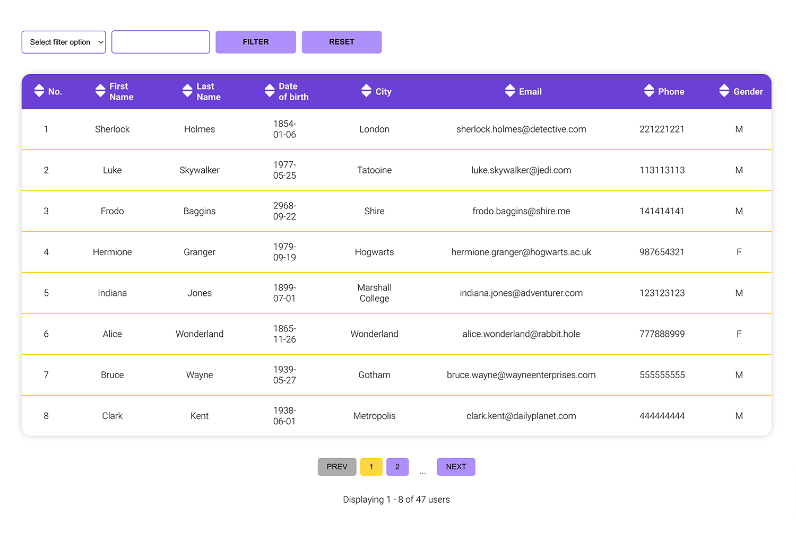

# Reusable Table Component

This is a reusable table component for displaying tabular data with features like sorting, filtering, and pagination. It is inspired by material-table and provides basic functionality for presenting and interacting with tabular data.

<p align="center">
  
</p>

## Technology Stack

      

### Features
- **Pagination**: Efficiently manage large data sets by dividing them into pages, providing a better user experience and performance.
- **Column-based Filtering**: Allows users to filter data based on specific column values. This feature can be enabled or disabled for each column.
- **Column-based Sorting**: Users can sort data in ascending or descending order based on any column. Like filtering, sorting can also be enabled or disabled per column.
- **Toggle Filtering and Sorting**: Provides flexibility by allowing the enabling or disabling of filtering and sorting on specific columns.
- **Error Messaging for Filtering**: When a user attempts to apply a filter without setting up the filtering option, an error message is displayed, guiding them to set up the filter correctly.
- **No Results Messaging for Filtering**: If the applied filters yield no results, a friendly message informs the user that no data matches their filter criteria.
- **Pagination with Filtering**: The pagination functionality takes into account any active filters, ensuring that the paginated data is consistent with the filtered results.

### Implementation Details
1. **Pagination**: Set the number of items per page and navigate through pages using the pagination controls.
2. **Filtering**: Enable filtering on desired columns. Users can input their filter criteria in the provided field for each column.
3. **Sorting**: Click on the column header to toggle between ascending and descending sorting order. Sorting preference is indicated visually.
4. **Enabling/Disabling Features**: Use component props to enable or disable filtering and sorting for individual columns.

## Getting Started

1. **Clone the repository**:
   ```bash
   git clone [Repo-URL]
   ```

2. **Navigate to the project directory**:
   ```bash
   cd [Repo-Name]
   ```

3. **Install dependencies**:
   ```bash
   npm install
   ```

4. **Run the application**:
   ```bash
   npm start
   ```

To use the Table component, you need to import it into your project with whole TableContainer and provide the necessary data and configuration. Here's how you can use it:

```javascript
import React from 'react';
import { TableContainer } from './TableContainer directory' // Import your table component
import { headersConfig } from './headersConfig directory'; // Import your table configuration

function App() {
  // Sample data
  const data = [
    // Your data objects here
  ];

  return (
    <div>
      <h1>Table Example</h1>
      <TableContainer rows={data} headersConfig={headersConfig} />
    </div>
  );
}

export default App;
```

### Configuration

The `headersConfig` contains an array of column configurations for your table. Each configuration object should have the following properties:

- `label`: The column label to be displayed.
- `title`: The column title to be displayed in the header.
- `sortValue`: A function that extracts the sorting value from the data object for this column.
- `isSortable`: A boolean indicating whether this column is sortable.
- `isFilterable`: A boolean indicating whether this column is filterable.

### Testing

Testing for the Table components is done using Jest and react-testing-library. 

To run tests, you can use the following command:

```bash
npm test
```

or

```bash
yarn test
```


## Styling

This component uses styled-components for styling. You can customize the styling by modifying the styles in the component's files or by overriding the CSS in your project.

## License

[MIT](https://choosealicense.com/licenses/mit/)

---

Crafted with ❤️ by [kozerka].

---
&nbsp;
